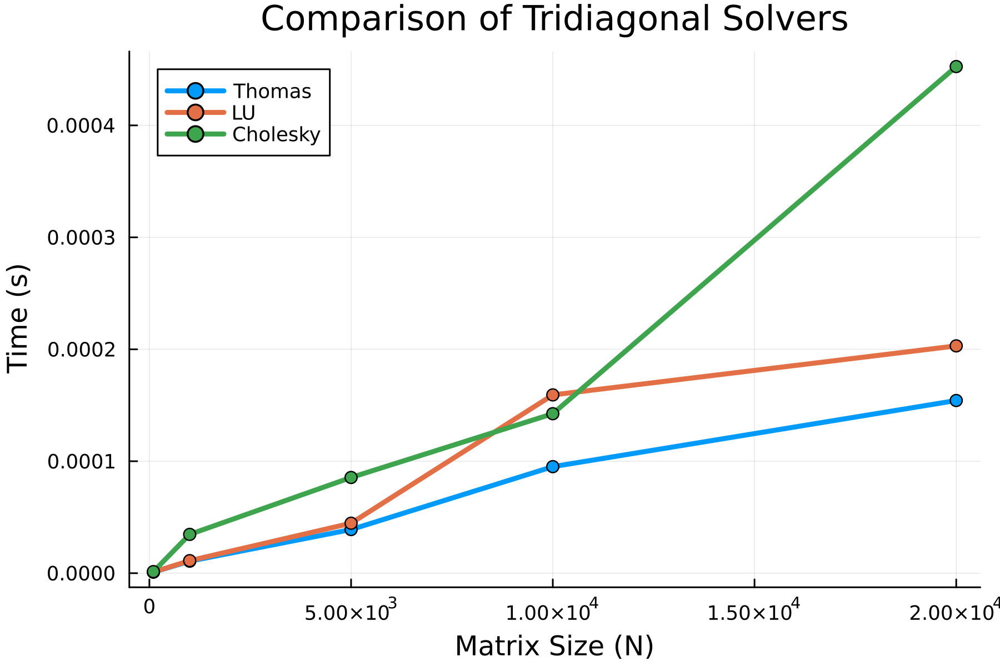

# Comparative Analysis of Tridiagonal Solvers

## 📌 Project Overview
This project implements and compares three direct methods for solving **Tridiagonal Systems of Linear Equations (SLAU)**:
1. **Thomas Algorithm** (TDMA) - $O(N)$ complexity.
2. **LU Decomposition** - Optimized for tridiagonal structure.
3. **Cholesky Decomposition** - For Symmetric Positive Definite matrices.

## 🚀 Technologies
* **Language:** Julia v1.x
* **Libraries:** `LinearAlgebra`, `Plots`, `BenchmarkTools`

## 📊 Results
We compared the execution time for matrix sizes $N=100$ to $N=20,000$.



**Key Findings:**
* All methods demonstrate linear $O(N)$ complexity.
* The **Thomas Algorithm** is the fastest due to minimal floating-point operations.
* **Cholesky** is slightly slower in this implementation due to the overhead of calculating square roots ($N$ times).

## 💻 How to Run
1. Install Julia.
2. Clone this repository.
3. Run the solver:
   ```bash
   julia tridiagonal_solver.jl
